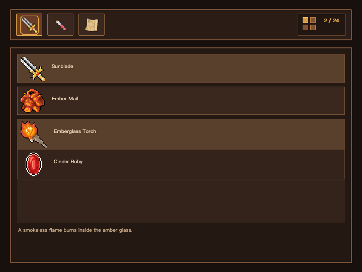

# Inventory Web example




Inventory demonstrates the ordinary `XAML → typed View → Selene WebGPU`
workflow. XAML owns the responsive visual tree and MoonBit owns the business
state, ViewModel projections, typed actions, and lifecycle. Its Equip, Use,
and Setup tabs resolve six named regions from one spritesheet; selection,
focus, hover, press, and disabled visuals are declared with ordered
`VisualStateGroup` overlays while the tab Entities remain mounted.

## Installation

Install MoonBit, Node.js, Google Chrome, and the dependencies declared by the
repository modules.

## Usage

Regenerate the View package after changing the model or XAML:

```bash
moon -C examples info inventory/model --target js
moon run selene-xaml/src/cmd/selene-xaml --target native -- generate \
  examples/inventory/inventory.xaml \
  --mbti examples/inventory/model/pkg.generated.mbti \
  --out-dir examples/inventory/view
```

Build the JS app, serve the repository root, and open the example:

```bash
moon -C examples-web build inventory/web --target js --release
python3 -m http.server 8000
```

Open `http://localhost:8000/examples/inventory/`. Append `?width=720` for the
narrow layout. Run `just -f selene-xaml/justfile capture-example-inventory` to
regenerate both checked-in Web screenshots through Playwright and Chrome.

The authored files are `inventory.xaml`, `model`, and `main.mbt`. The generated
View package lives in `view`. Semantic View and layout coverage lives in
`selene-xaml/tests/target-matrix`; browser and screenshot orchestration lives
in `selene-xaml/tests/browser`.

The artwork is a curated CC0 subset of Henrique Lazarini's 7Soul1 RPG icon
collection. Provenance and derivative details are in
[`assets/README.md`](assets/README.md).
