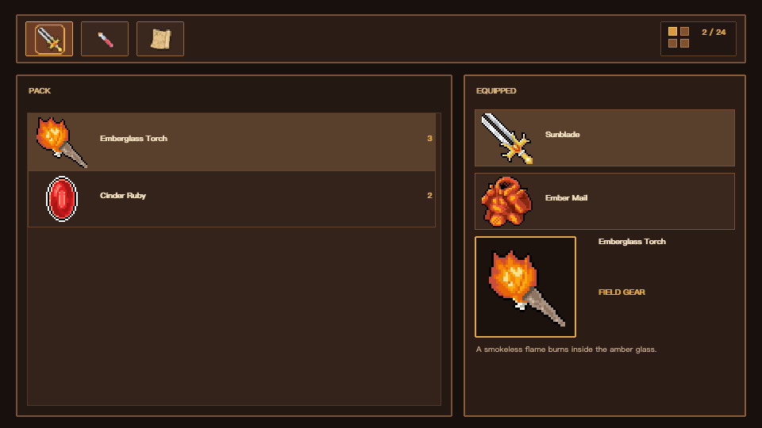

# Selene XAML



`KKKIIO/selene_xaml` compiles a selected MS-XAML-2017 object-mapping profile
and the Selene UI vocabulary into typed MoonBit View packages for Selene.

The exact Profile 1 surface and deviations are recorded in
[`docs/ms-xaml-conformance.md`](docs/ms-xaml-conformance.md).

## Installation

The native compiler CLI and the generated View runtime are separate MoonBit
modules. Install the CLI from this source checkout:

```bash
git clone https://github.com/kkkiio/selene_xaml.git
cd selene_xaml
moon install ./src/cmd/selene-xaml
```

Add the runtime and the upstream Selene module to the consuming application's
`moon.mod`:

```moonbit
import {
  "KKKIIO/selene@0.37.3",
  "KKKIIO/selene_xaml_runtime@0.1.0",
}
```

Until `KKKIIO/selene_xaml_runtime` is published, include this checkout's
`runtime` module in the application's `moon.work`, as the repository examples
do.

## Usage

The complete command reference is available in the
[`docs/cli`](docs/cli/README.md) usage documentation.

Define your state types in a MoonBit model package, declare them in XAML with
`xmlns:model`, then generate a typed View package:

```xml
<!-- counter.xaml -->
<Flex xmlns="urn:selene:xaml:ui"
      xmlns:x="http://schemas.microsoft.com/winfx/2006/xaml"
      xmlns:model="moonbit:your_game/model"
      x:Class="CounterView" DataType="model:CounterState"
      Direction="Column" Gap="12" Padding="16">
  <Text Text="{Binding Path=label}" FontSize="24" Color="#f0ddbd" />
  <Button x:Name="increment" OnClick="increment">
    <Text Text="+1" Color="#f0ddbd" />
  </Button>
</Flex>
```

```bash
moon -C your_game info src/model --target js
selene-xaml generate \
  your_game/counter.xaml \
  --mbti your_game/src/model/pkg.generated.mbti \
  --out-dir your_game/src/view
```

```moonbit
let entity = @entity.Entity()
@counter_view.CounterView::mount(entity, CounterState::{ label: "0" })

for envelope in @event.EventReader().read(@counter_view.action_event_bus) {
  match envelope.action {
    Increment => @counter_view.CounterView::replace(
      entity,
      CounterState::{ label: "1" },
    )
  }
}
entity.destroy()
```

The generated package exposes `mount`, `replace`, `apply`, and a typed
`action_event_bus`. [`examples/inventory`](examples/inventory) is a complete
WebGPU demo with responsive layout, items lists, and equipment slots.

### WebAssembly Component Guests

Pass a WIT file instead of `.mbti` for a standalone `.component.wasm`:

```bash
selene-xaml generate \
  your_game/component_ui.xaml \
  --wit your_game/wit \
  --out-dir your_game/src/component_view
```

The Component Guest uses Host-provided Entity `u32` keys and exports `handle-event`; it does not
import Selene Entity or the Embedded EventBus.
