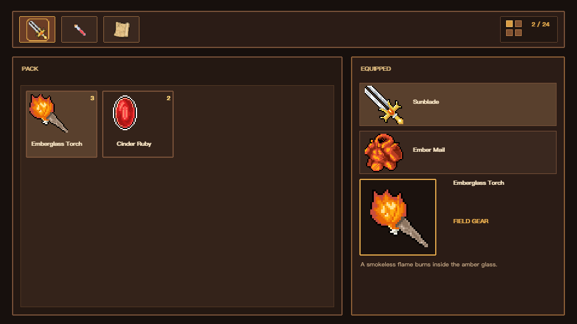

# Selene XAML



`KKKIIO/selene_xaml` compiles a selected MS-XAML-2017 object-mapping profile
and the Selene UI vocabulary into typed MoonBit View packages for Selene.

The exact Profile 1 surface and deviations are recorded in
[`docs/ms-xaml-conformance.md`](docs/ms-xaml-conformance.md).

## Installation

The generated View runtime is part of `KKKIIO/selene`. Install the native
compiler CLI from this source checkout:

```bash
git clone https://github.com/kkkiio/selene.git
cd selene/selene-xaml
moon install ./src/cmd/selene-xaml
```

Add Selene to the consuming application's `moon.mod`:

```moonbit
import {
  "KKKIIO/selene@0.37.3",
}
```

## Usage

The complete command reference is available in the
[`docs/cli`](docs/cli/README.md) usage documentation.

Define your state types in a MoonBit model package, declare them in XAML with
`xmlns:model`, then generate a typed View package:

```xml
<!-- counter.xaml -->
<Flex xmlns="urn:selene:xaml:ui"
      xmlns:x="http://schemas.microsoft.com/winfx/2006/xaml"
      xmlns:model="moonbit:your_game/model"
      x:Class="CounterView" DataType="model:CounterState"
      Direction="Column" Gap="12" Padding="16">
  <Text Text="{Binding Path=label}" FontSize="24" Color="#f0ddbd" />
  <Button x:Name="increment" OnClick="increment">
    <Text Text="+1" Color="#f0ddbd" />
  </Button>
</Flex>
```

```bash
moon -C your_game info src/model --target js
selene-xaml generate \
  your_game/counter.xaml \
  --mbti your_game/src/model/pkg.generated.mbti \
  --out-dir your_game/src/view
```

```moonbit
let entity = @entity.Entity()
@counter_view.CounterView::mount(entity, CounterState::{ label: "0" })

for envelope in @event.EventReader().read(@counter_view.action_event_bus) {
  match envelope.action {
    Increment => @counter_view.CounterView::replace(
      entity,
      CounterState::{ label: "1" },
    )
  }
}
entity.destroy()
```

The generated package exposes `mount`, `replace`, `apply`, and a typed
`action_event_bus`. [`examples/inventory`](../examples/inventory) is a complete
WebGPU demo with responsive layout, item lists, and equipment slots.
