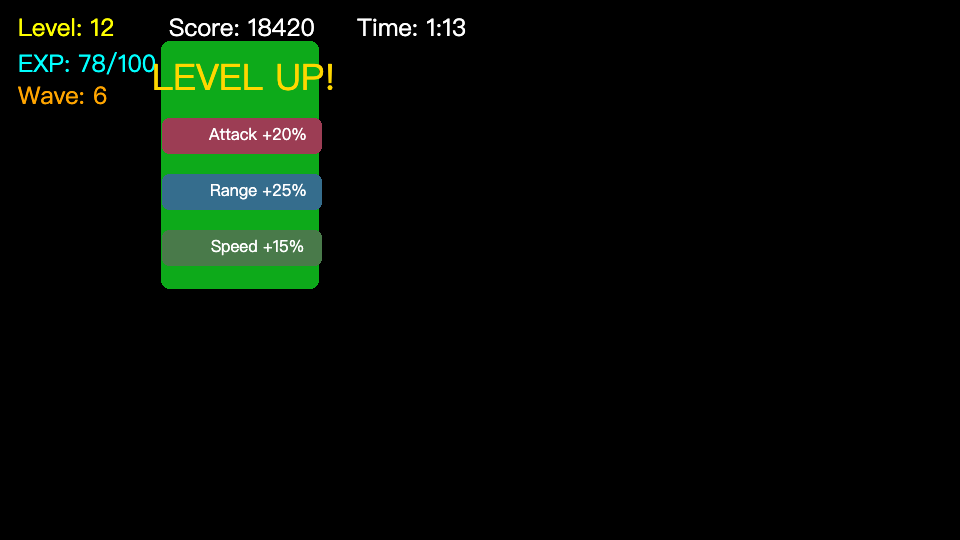

# Survivors WebAssembly Component showcase



This is the repository's dedicated `js + wasm-component` showcase. It compiles
the same [`Survivors XAML`](../survivors/survivors.xaml) used by the ordinary
Web example into a typed MoonBit guest, packages it as a WebAssembly
Component, transpiles it for the browser with JCO and connects it to Selene
through the versioned tree Host.

## Installation

Install MoonBit, Node.js, `wasm-tools`, and `just`.

The repository installs JCO from `component/package-lock.json` during the build.
`wit-bindgen-cli` is needed only when changing WIT and regenerating the tracked
bindings with `just generate-wasm-component-bindings`.

## Usage

Build and validate the Component from the repository root:

```bash
just build-wasm-component
```

To open the resulting JCO module with the browser runner:

```bash
moon -C examples/wasm-component/host build src/app --target js --release
python3 -m http.server 8000
```

Open `http://localhost:8000/examples/wasm-component/web/`.

[`component`](component/) contains the business WIT, generated guest and build
manifest. [`web`](web/) contains the Selene WebGPU runner. Module `load/unload`
and Entity `mount/unmount` remain explicit so the showcase also demonstrates the
Component lifecycle boundary.
